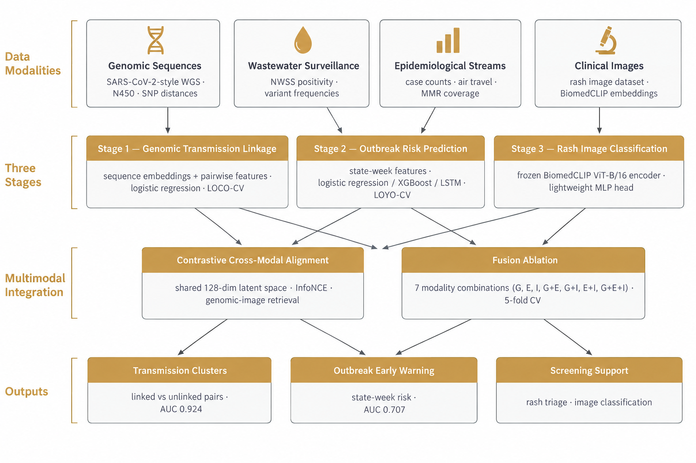

# Measles Multimodal ML

**A multimodal machine learning framework integrating genomic, epidemiological, environmental, and clinical imaging data for measles detection and transmission inference.**

[](https://arxiv.org/)
[](https://www.python.org/)
[](LICENSE)

**Official replication repository and dataset for the preprint:**

***"A Multimodal Machine Learning Framework Integrating Genomic, Epidemiological, Environmental, and Clinical Imaging Data for Measles Detection and Transmission Inference"***

Jiada Li, PhD — AI Scientist, Albany, NY, USA 12205
Contact: jiadali2017@gmail.com

---

# Overview

Measles resurged sharply in the United States in 2025–2026. This repository reproduces a
three-stage multimodal ML framework — plus two integration analyses — built entirely from
**publicly available data**:

| Stage / Integration Analysis | Task | Model | Validation | Headline result |
|---|---|---|---|---|
| Stage 1 | Genomic transmission linkage (903 pairs, 43 OAW cases) | Logistic regression (+ RF) | LOCO-CV | **AUC 0.924**, F1 0.911 |
| Stage 2 | State-week outbreak risk (wastewater + epi) | Logistic regression (+ XGBoost, RF, LSTM) | LOYO-CV | **AUC 0.707** (extreme imbalance, 3–7% positive) |
| Stage 3 | Rash image classification (MSLD v2.0, 755 images, 6 classes) | BiomedCLIP ViT-B/16 + MLP | stratified 5-fold | see `results/stage3_imaging_results_real.json` |
| Integration Analysis A | Contrastive genomic–image alignment | InfoNCE, shared 128-dim space | held-out pairs | Recall@1 = 0.985 (synthetic pairs) |
| Integration Analysis B | Fusion ablation (7 modality combos) | LR on concatenated embeddings | 5-fold CV | genomic features dominate linkage task |

## Workflow



## Repository layout

| Path | Contents |
|------|----------|
| `workflow_design.png` | Pipeline schematic (repo home-page figure) |
| `data/` | All input and intermediate data: OAW genomic sequences (N450 + WGS alignments), SNP distance matrices, stage 1 pairwise features, NWSS wastewater series, NNDDSS weekly cases, air-passenger and MMR-coverage features, MSLD v2.0 image manifest + BiomedCLIP embedding cache, trained model checkpoints |
| `scripts/` | Reproduction notebooks (`reproduce_pipeline_v2.ipynb`, auto-exported `.py`) |
| `results/` | All result figures (architecture, ROC, temporal, imaging, alignment, ablation, validation summary) and metric CSV/JSON outputs |
| `docs/` | Run walkthrough and data-source documentation (Word) |
| `requirements.txt` | Python dependencies |

## Installation

```bash
git clone https://github.com/Jiadalee/measles-multimodal.git
cd measles-multimodal
pip install -r requirements.txt
```

## Quick start

Launch `scripts/reproduce_pipeline_v2.ipynb` (or the exported `.py`) and run stages in
order: Stage 1 genomic linkage → Stage 2 outbreak risk → Stage 3 imaging → Integration Analysis A (contrastive alignment) → Integration Analysis B (ablation). All inputs are in `data/`; all expected
outputs are in `results/` for verification.

## Evaluation scope (benchmark vs. clinical evidence)

The metrics reported here establish **task-level capability** on retrospective public
data. Following the capability → evidence → safety → workflow → clinical-outcome
evidence ladder, the following remain open: expert validation by microbiologists and
epidemiologists, human-AI workflow comparisons, prospective validation on live
surveillance streams, and demonstrated public-health outcomes. Benchmark scores are
evidence of capability, not evidence of clinical effectiveness.

## License

Apache-2.0. See [LICENSE](LICENSE).
